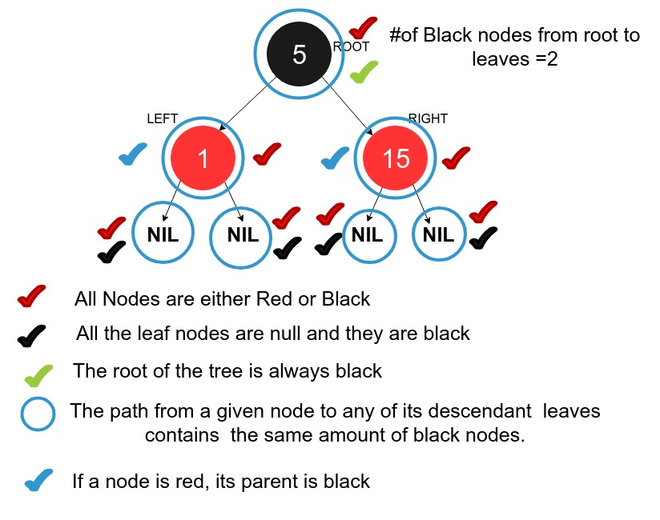

### Structure of Red Black Tree
Each node contains the following fields:

   - key
   - left – pointer to the root of left subtree.
   - right – pointer to the root of right subtree.
   - parent – pointer to the parent node.
   - color- color of the node, either RED or BLACK

### Properties of Red Black Tree

   - Each node is either red or black.
   - The root of the tree is always black.
   - All leaves are null (Depicted as NIL in diagrams) and they are black.
   - If a node is red, then its parent is black.
   - Any path from a given node to any of its descendant leaves contains the same amount of black nodes. This is sometimes known as the black-depth.

### Why do we impose such properties ?

   - Binary Search Tree in worst can can have a complexity of O(n) in insert and delete. The Red-Black trees guarantee a O(log(n)) in insert, delete (even in worst case).
   - They are balanced search trees and therefore balance themselves to always maintain a height of log(n),due to such restrictions.

### Pictorial Representation of properties of a Red Black Tree

