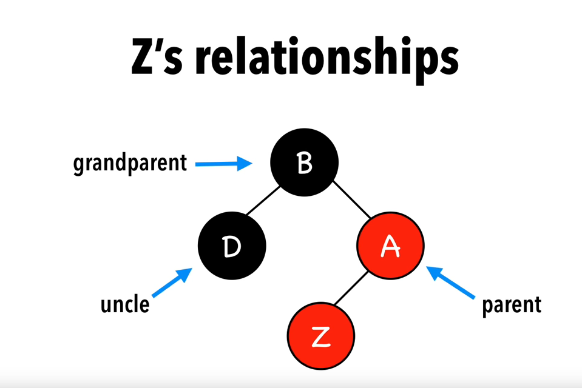

<iframe src="https://www.youtube.com/embed/CO-QPo-nQoU" frameborder="0" allow="autoplay; encrypted-media" allowfullscreen></iframe>

### Uncle and grandparent nodes in a red black tree

   - Let Z be the node being studied.
   - Uncle nodes refer to the sibling nodes of the parent node of Z.
   - Grandparent node refer to the parent node of the parent node of Z.

### Pictorial Representation of uncle,parent and grandparent nodes in a red black tree

### Insertion Algorithm

Let Z be the node to be inserted.

   - Insert Node and color it red.
   - Recolor and rotate nodes to fix violations

There are 4 subcases to be handled to fix violations.

Case 1.Z is the root node.

   - Color the node as black.

Case 2.The uncle node of Z is red.

   - Recolor the parent and grandparent of Z to fix violations.

Case 3.The uncle node of Z is black and Z, parent node of Z and grandparent node of Z form a triangle.

   - Rotate parent of Z.

Case 4.The uncle node of Z is black and Z, parent node of Z and grandparent node of Z form a line.

   - Rotate the grandparent of Z and recolor the parent and grandparent of Z to fix violations.

