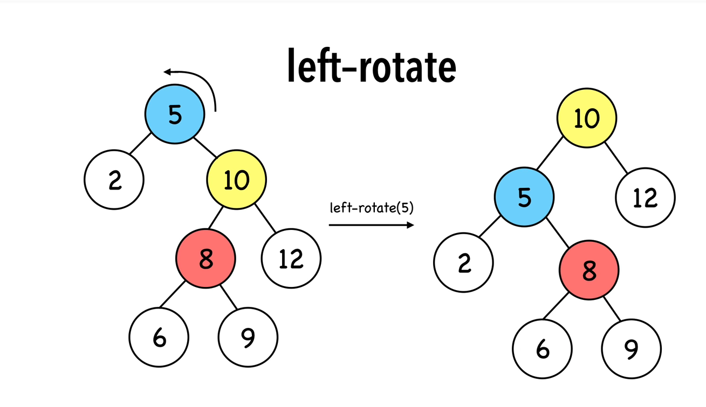
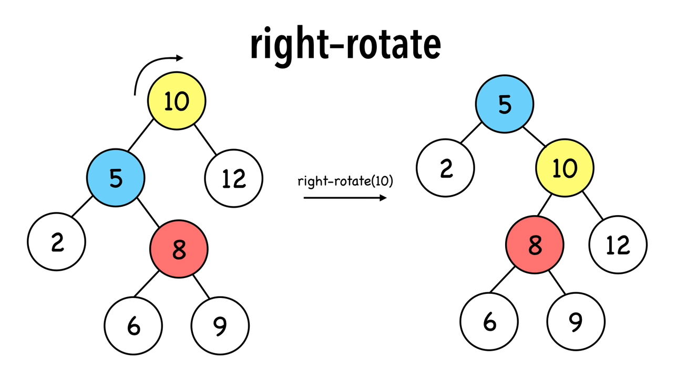

### What is rotation in search trees ?

Tree rotation is an operation on a search tree that changes the structure without interfering with the order of the elements.

### Why do we need to do rotations in Red Black Trees
The maximum height of the red black tree is O(log n). To Maintain this height, rotation operations is performed. Rotation alters the stucture of the tree by rearranging subtrees. There are two kinds of rotations performed.

   - Left Rotation
   - Right Rotation

### W Left Rotation Algorithm
Let the node to be rotated is x. Let the right subtree of node x be y.

   - Turn y's left subtree into x's right subtree.
   - Link the parent of x to y.
   - Put x as left subtree of y.
   - Set parent of x as y.

### Right Rotation Algorithm
Let the node to be rotated is x. Let the left subtree of node x be y.

   - Turn y's right subtree into x's leftt subtree.
   - Link the parent of x to y.
   - Put x as right subtree of y.
   - Set parent of x as y.

### Pictorial Representation of properties of a Left Rotation

### Pictorial Representation of properties of a Right Rotation

