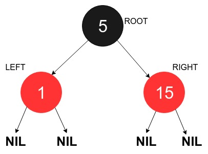

<iframe src="https://www.youtube.com/embed/mEtIeulc48Y" frameborder="0" allow="autoplay; encrypted-media" allowfullscreen></iframe>

### What is Red Black Tree?

A Red-Black Tree is a binary search tree with one extra attribute for each node: the colour, which is either red or black. We also need to keep track of the parent of each node.

### Basics of Red Black Tree
<iframe src="https://www.youtube.com/embed/hBm98I3LVxE" frameborder="0" allow="autoplay; encrypted-media" allowfullscreen></iframe>

### Pictorial Representation of a Red Black Tree

